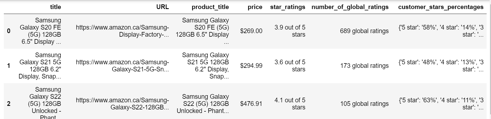
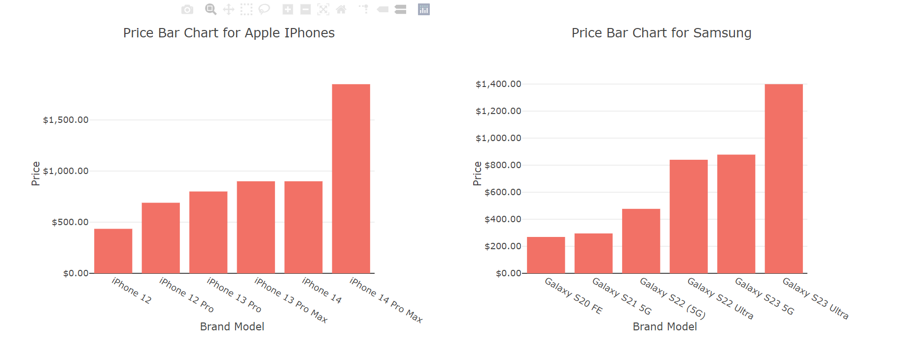

# Amazon_Web_Scrapping_ETL_EDA
 Embark on an engaging project that seamlessly combines the thrill of gaming with the tech-driven realms of web scraping, ETL (Extract, Transform, Load), and insightful exploratory data analysis (EDA). Dive into the Amazon ecosystem as you leverage these techniques to uncover hidden gems, transform raw data into meaningful insights, and create an immersive experience at the intersection of data exploration.

# Web Scraping with Beautiful Soup
# Data Visulizations with Plotly.js

Hey, Welcome to 'Amazon Dashboard,' where we bring together the forces of web scraping, Plotly, and a Flask-powered API to create an immersive data visualization experience. Uncover patterns, manipulate data, and interact with insights in real-time.

### Introduction 

As a global e-commerce giant and digital services provider, Amazon complements the tech experiences offered by both Samsung and iPhone.Together, the dynamic trio of Samsung, iPhone, and Amazon creates a seamless, interconnected digital experience. From the latest smartphones to smart home integration and effortless online shopping, this collaboration defines the modern intersection of technology and convenience.

This ETL process for 'Amazon ETL & Visualizations' break into three deliverables.

Deliverable 1: Web Scaping Using Beautiful Soup.

Deliverable 2: Data Cleaning Using Jupyter Notebook.

Deliverable 3: Flask-powered API & Data Visualizations Using Plotly.js

## Deliverable 1: Web Scaping Using Beautiful Soup

Hey, let's explore the data with web scrapping and analyze the data using Beautiful soup and Pandas Python Data Analysis.

### 1.1 Prerequisites

Before you begin, ensure you have the following installed:

Python 3.6 or higher

Beautiful Soup 4

Requests (for making HTTP requests)

Pandas (for data analysis)

### 1.2 Data Sources

We scrape data from the Amazon Website URLs for Apple & Samsung Smart Phones:

The structre of the Webpages can view here: 

[Product Details](https://www.amazon.ca/Apple-iPhone-14-Pro-Max/dp/B0BN94DL3R/ref=sr_1_2?crid=T250NW0QDQDB&keywords=iphone%2B14%2Bpro%2Bmax&qid=1702312056&sprefix=%2Caps%2C81&sr=8-2&th=1)

[Customer Reviews](https://www.amazon.ca/Apple-iPhone-14-Pro-Max/dp/B0BN94DL3R/ref=sr_1_2?crid=T250NW0QDQDB&keywords=iphone%2B14%2Bpro%2Bmax&qid=1702312056&sprefix=%2Caps%2C81&sr=8-2&th=1#customerReviews)

### 1.3 How We Extracted and Stored Data  

Defines a list of URLs for iPhone and Samsung products on Amazon.

Defines a function scrape_amazon_product to extract relevant information from Amazon product pages using BeautifulSoup and requests.

The function extracts product title, price, star ratings, number of global ratings, customer stars percentages, and features and ratings.

It also contains a function extract_model_number to extract the model number from the product title.

The script showcases a systematic approach to web scraping.

Defines dictionaries 'iphone_scraped_data' and 'samsung_scraped_data' to store scraped data for iPhone & Samsung products.

Loops through each brand's URLs, calls the scrape_amazon_product function, and stores the scraped data in the dictionaries. Saves the scraped data to JSON and CSV files.

Creates DataFrames 'scraped_iphone_df' and 'scraped_samsung_df' from the scraped data. Splits the 'title' column into multiple columns based on commas. Saves the modified DataFrames to CSV files.

## Deliverable 2: Deliverable 2: Data Cleaning Using Jupyter Notebook

Hey, let's clean the data for robust Python Data Analysis experiences using Pandas and Regular Expressions.

### 2.1 Prerequisites

Before you begin, ensure you have the following installed:

Python 3.6 or higher

Regular Expressions

Data Analysis ( Pandas, Numpy, Scikit-learn )

### 2.2 Data Sources

We use the data resources from two files 'scraped_iphone_data.csv' and 'scraped_samsung_data.csv' using Pandas.

### 2.3 How We Cleaned The Data

Drops unnecessary columns.

Extracts and converts storage capacity, color, price, star ratings, global ratings, and customer stars percentages to appropriate data types using regular expressions.

Creates new columns, including 'brand,' 'model_year,' and reorders columns with appropriate names.

Saves cleaned 'iphone_samsung_df' data to JSON and CSV files.

## Deliverable 3: Flask-powered API & Data Visualizations Using Plotly.js

Hi, let's  Explore the world of Amazon, Apple, and Samsung like never before!

### 3.1 Prerequisites

Before you begin, ensure you have the following installed:

Flask (Imports the Flask framework, allowing the creation of a web application)

jsonify ( Python dictionaries to JSON responses, and render_template facilitates rendering HTML templates )

render_template  (facilitates rendering HTML templates)

HTML, CSS, Bootsrap ( for structure and style web page)

JavaScript ( for dynamic behavior)

Sweetalert ( for Dashboard POPUP BOXES)

D3.js ( for data manipulation)

Plotly ( for interactive graphs )

### 3.2 Flask API Routes

#### Home Page Route (@app.route("/")): 

Renders the "index.html" template when users access the home page ("/").

#### iPhone and Samsung Details API Routes:

The below routes read merged iPhone and Samsung data from a CSV file, converts it to JSON, and returns it as a JSON response:

/api/iphone_samsung_details

/api/iphone_details

/api/samsung_details

### 3.3 Data Visualizations

#### 3.3.1 SweetAlert JS Library

Displays a SweetAlert notification when the page loads.

Includes a SweetAlert popup to display a success message when the page loads, providing a user-friendly experience.

#### 3.3.2 Product Selection and Dashboard Initialization:

Created a dropdown menu to select different iPhone and Samsung models.
Upon selection, populates demographic information, builds pie charts, and bar charts for the selected product.

Also, initializes specific charts for Apple and Samsung brands.
Populating Product Information:
Retrieves specific information (brand, color, price, storage capacity) for the selected product and displays it.

Constructs a pie chart displaying the distribution of star ratings for the selected product.
Building Bar Chart for Product Star Ratings:

#### 3.3.3 Bar Chart for Apple Samsung Product & Price 

Constructs a bar chart displaying the prices of Apple & Samsung phones.

Bar chart displaying the distribution of star ratings for Samsung brand models.

#### 3.3.4 Line Chart for Model Years

Line chart showing the evolution of brand models over different model years for both Apple and Samsung with respect to price.

#### 3.3.5 Bubble Chart for Global Ratings

Bubble chart showing the relationship between global ratings, price, and brand models for both Apple and Samsung.

The size of each bubble is determine by the corresponding overall "star_ratings".

### 3.3 Dashboard Layout

## Authors

## [Maira Syed GitHub](https://github.com/mairasyed)

## [Aruna  Venkatachalam GitHub](https://github.com/arunavenkatachalam)

## [Jalees Moeen GitHub](https://github.com/JaleesMoeen)